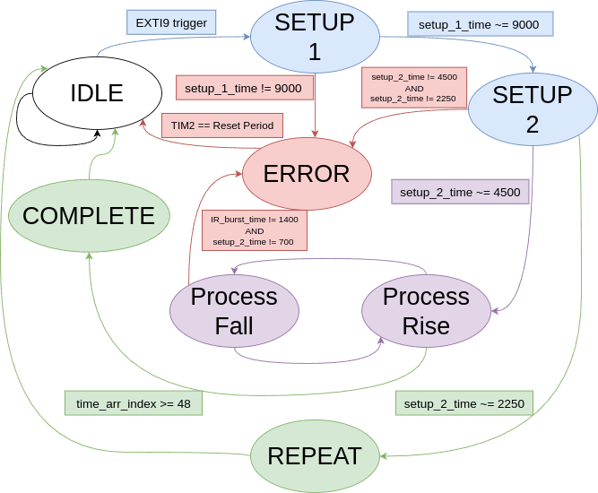

# IR(Infrared) Decoder Overview
- This project tackles decoding and processing an IR signal from an IR remote using the NEC/Japanese protcol 
- The project utilizes the following:
    - Timer counter with rising and falling edge triggered interrupts to handle timing for decoding transmission bits
    - State machine to manage protocol decoder state
    - GPIO input 

## Decoder State Machine
- The IR decoder uses a state machine to manage what the processor is doing at any given point
- The state are:
    - `IR_STATE_IDLE` = 0 
    - `IR_STATE_SETUP_1` = 1
    - `IR_STATE_SETUP_2` = 2
    - `IR_STATE_REPEAT` = 3
    - `IR_STATE_PROCESS_RISE` = 4
    - `IR_STATE_PROCESS_FALL` = 5
    - `IR_STATE_ERROR` = 6
    - `IR_STATE_COMPLETE` = 7
- Below is the diagram showing the different states and how the state machine manages states

- It's important to note that the program FSM current state doesn't execute the corresponding state actions or checks until the next interrupt.
  - For example, at startup, the current state is IDLE, if an interrupt occurs the current state is set to SETUP_1 but does not execute the SETUP_1 checks until the next interrupt. 
- Another note is that the timer 2 prescalar value is set to 15 so that with the default 16MHz clock speed the counter counts about 1 count per 1 microsecond
  - This means that if the counter value is 1000, 1 milisecond has passed
### Walking through FSM States and Transitions
- The FSM will always start in IDLE state and only leave that state if the EXTI9 interrupt line is triggered
- Once a trigger occurs, the program enters the `IR_STATE_IDLE` case statement, where the FSM is set to SETUP_1 and starts the timer 2 counter used throughout a transmission frame for timing of pulse widths and a reset if the transmission goes beyond the frame timing or an error occurs
- Upon the next interrupt, the counter value is checked
  - If the value is around 9000 (given +-500 for margin of error) the state enters setup 2
  - If the value is not within the margin of error, the state is set to ERROR
    - After the TIM2 gets to the reset period value(a bit longer than a single IR transmission frame), the FSM is reset back to IDLE and all transmission value are reset
- In SETUP_2, a similiar process to SETUP_1 occurs and checks if the time between setups is around 4500 (Again with +-500 MoE) or 2250 (with 250 MoE).
  - If the setup 2 time is with 4500 range, the state is set to PROCESS_RISE
  - If the setup 2 time is within 2250 range then the state is set to REPEAT
  - Otherwise the state is set to ERROR
- The FSM enters data processing when first set to PROCESS_RISE. 
  - In this state the program captures the current value of timer 2 for reference then checks if `timer_arr_index` is greather than or equal to 48
  - As the state name suggests this check occurs during the rising edge of the IR transmission and the start of the bit timing 
    - The `timer_arr_index` keeps track of pulse width timings of each data bit in an array
    - Since the transmission will send 48 bits in total, once the index reaches 48 the transmission is complete and enters the COMPLETE state
  - If the `timer_arr_index` is less than 48, then the FSM enters PROCESS_FALL 
- In the PROCESS_FALL state and on the falling edge of the IR tranmsission the program captures the pulse width timing then checks if it's around 1400 (meaning logic 1 recieved) or around 700 (meaning logic 0 received), otherwise an error has occured and FSM is set to ERROR
- When the FSM has processed all 48 bits, the FSM is set to COMPLETE. Within the main loop, the program polls the state of the FSM.
  - If the state is COMPLETE, the EXTI is disabled to allow the necessary execution correspodning to the command to occur without disruption
    - Once the command execution is complete the EXTI is re-enabled 

# TODO
- [ ] Implement basic that is around 100ms and we start the timer upon recieving signal, then reset `interrupt_count` and varibles like that after completion of the timer
    - This avoids if other IR remotes mess with our stuff we can recover
# Program Flow
- 

# Design Notes

## Brain Dump (8/14/24 3:51 PM)
Ok so here's the plan:
1. We are going to just have one timer running for about 105ms (the length of one transmission), we have a single bit getting flipped to determine if the incoming interrupt trigger was from rising to logic high or falling to logic low
    - So initially during the 9ms setup, the trigger is a falling edge but the 9ms ends at the rising edge. 
2. While the timer is running, we start it immedietly when the first trigger happens and intially capture the starting cnt value, we don't start toggling the rising and falling until the 9ms is set and the next timer is either 4.5 or 2.5
3. Once the setup has been captured,  we can use the state machine value to enter a state of either data processing or repeat (the FMS should be in the setup state before hand)
    - This means we'll have a case statement in the interrupt handler which hopefully isn't too bad
    - It would only be one case statement that checks the current state
4. If we are in data processing state then we begin toggling `edge_tracker` keeping track of rising and falling. 
    - If `edge_tracker` is 1, it's risen and would in theory read a logic HIGH value from the IR sesnor input
    - If `edge_tracker` is 0, it's fallen and the IR sesnor would read at logic LOW value
    - Thus, if `edge_tracker` is 1 that indicates the begginning of a pulse and shall capture the value of the current timer cnt
    - If `edge_tracker` is 0, indicating end of pulse, we can just evaluate if the current cnt is within a range of 2.25 or 1.125 and bit shift a 1 or a 0 into a buffer for the incoming IR command based on the timer difference measured. 
5. The timer should be setup to overflow and interrupt the program to reset values. 

## Keep interrupt handler short and sweet
- It's vital to keep the interrupt handler short otherwise while handling the interrupt, another interrupt might trigger, meaning the handling won't complete
    - I ran into this problem trying to use my crappy UART printf function to debug but caused tons of problems.
- Especifally as the data bits are being processed, the interrupts are triggered nearly every 3-5ms 
- This forced me from handling all the setup and data bits, which included starting, stopping the timer, capturing the counter value, storing the value etc, to now having more a state machine approach
    - Now the setup is detected from the inital falling edge of the IR sensor, then that transitions the program into the IR_STATE_DATA bits where the main loop handles the data bit processing


## PWM Input Mode :x:
### Overview
- PWM input mode is a variation of input capture mode
- PWM input mode has two input capture signals connected to the timer input
    - The signals trigger on opposite polarity edges
### Setup/Important Registers
- **TIMx_CCMR1** (Timer Caputre/Compare Mode Register): Found in section 18.4.6, this register sets the mode (input, output, PWM) of channel 1 and 2 for a timer
    - **CC1S** (Caputre/Compare 1 Selection) = `0b01`. This configures channel 1 as input and maps Input Capture 1 (IP1) to Timer Input 1 (TI1)
    - **CC2S** (Caputre/Compare 2 Selection) = `0b10`. This configures channel 2 as input and maps Input Capture 2 (IP2) to Timer Input 1 (TI1)
- **TIMx_CCER** (Timer Caputre/Compare Enable Register): Found in section 18.4.7, this register enables channels and configuring the channels as input or output and when to what polarity of the signal edge to capture on
    - **CC1P** (Capture/Compare 1 Polarity) = `0b0`. Refer to CC1NP description below
    - **CC1NP** (Caputre/Compare 1 Complementary Polarity) = `0b0`. Clearing CC1P and CC1NP sets the active polarity for the Timer Input 1 Filter Pin 1 (TI1FP1) to the rising edge
    - **CC2P** = `0b1`. Refer to CC2NP description below
    - **CC2NP** = `0b1`. Same as CC1P and CC1NP however is activated on the falling edge
- **TIMx_SMCR** (Timer Slave Mode Control Register): Found in section 18.4.2, the register configures the trigger input (internal trigger, TI edge detector or Filtered timer input) and what the trigger does (such as reset counter) 
    - **TS** (Trigger Selection) = `0b101`. This selects the Timer Input Filtered Pin 1 as the trigger input 
    - **SMS** (Slave Mode Select) = `0b100`. When the external signals are selected on a rising edge, the counter is reinitialized and the registers are updated
- **TIMx_CCER** (Timer Capture/Compare Enable Register): Found in section 18.4.7, the register bits are used to enable polarities and capture/compare outputs
    - **CC1E** (Capture/Compare 1 Enable) = `0b1`. Capture 1 is enabled 
    - **CC2E** (Capture/Compare 2 Enable) = `0b1`. Capture 2 is enabled 

## Flow of triggers from IR protocol
- We want to store the timings of bursts in the IR transmissions into an array.
    - To do this, we can have seperate variables for storing the timings of the start transmission and the rest of the bits
- The protocol starts with a 9ms LOW then 4.5ms HIGH signal to indicate beggining of transmission
    - So we'd store those timings then start using an array to store the 48 bits of info received. 
- The EXTI is triggered on both rising and falling edges, so the first 4 times the interrupt is triggered is during the setup, then the next 96 triggers are the rise and falls of the bits.
    - During the setup the timer is enabled immedietly, then the counter value is reset on the rising edge of the 4.5ms setup, then on the falling edge the timer is reset and disabled until the next rising edge
    - On each successive rising edge the timer is enabled and each falling edge stores the value,disables the counter, and resets the value.
- Using the counter value we can use the equation: (counter\_value)/(Periph\_clock) = total\_time
    - This time would be in seconds

 
# Abbreviation Breakdown (incomplete)
- ICx => Input Capture. The `x` referes to the capture channels, typically being 1 or 2. 
- TIxFP => Timer Input Filtered Pin. 


- RCC => Reset and Clock Control 
    - This module is used to enable/disable clock signals sent to different peripherals
- AHB1ENR => Advanced High-Performance Bus 1 Enable Register
    - The [STM32F446](https://www.st.com/resource/en/datasheet/stm32f446re.pdf) interconnects all Majors (CPUS, DMAs, USB HS) and subordinates (flash mem, RAM, QuadSPI, etc) using a bus matrix
    - Thus we need to let the CPU know which bus to connect to. 
    - So we set AHB1ENR to enable the GPIO A clock 
- GPIO => General Purpose Input/Output
    - This refers to peripheral pins for a board that deal with input and output data
- RCC\_AHB1ENR\_GPIOAEN => GPIO A Enable
    - This refers to the address of the GPIOA clock which is `0x00000001` 
- MODER => Mode Register
- GPIO\_MODER\_MODER5\_0 => This is a bit mask that sets the mode for pin 5  to output
    - Going to the definition of GPIO\_MODER\_MODER5\_0, it expands to the value `0x00000400` which is `0b0100 0000 0000`. 
        - So we can start to see the structure of the address, since if we group the binary value into groups of 2 bits, we can see that the expansion is setting the 5th set of bits.
        ```
        0b |01| |00| |00| |00| |00| |00|
            P5   P4   P3   P2   P1   P0 
        ```
        - If we set this value to `0x00000C00` (`0b1100 0000 0000`) we would be setting Pin 5 to Analog mode
- ODR => Output Data Register
    - Using `GPIO_ODR` we can set the value of the ODR. 
    - Each GPIO has its own ODR, where each ODR is 32 bits and can be used to set the state of a pin
        - For example, we set `GPIOA->ODR` equal to `GPIO_MODER_MODER5_0`, which we showed to expand to be a 1 at the 5th group of 2 bits. 
 
